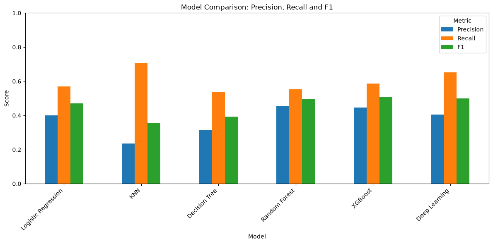
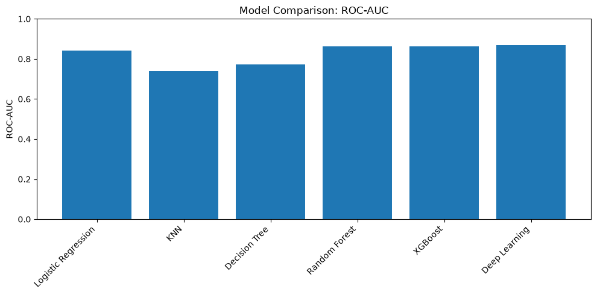
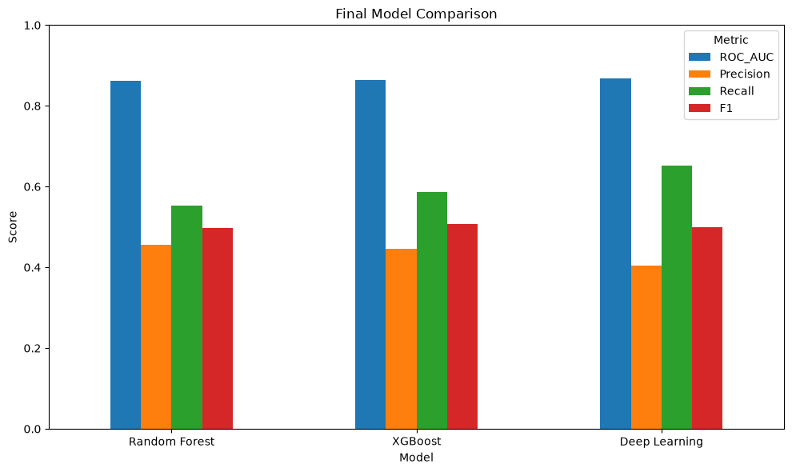

# ICU Mortality Prediction with MIMIC-III

An end-to-end clinical machine learning project: from large-scale ICU event processing to patient-grouped evaluation of in-hospital mortality risk.

## Project Highlights

- **MIMIC-III clinical database:** 45,253 adult ICU stays with a first 24-hour clinical window.
- **83 predictors:** laboratory trajectories, vital signs, outputs, interventions, and demographics.
- **Patient-level split using `SUBJECT_ID`:** repeated ICU stays stay together, with explicit leakage prevention.
- **Class imbalance handling:** class weighting, SMOTE experiments, and threshold tuning across multiple ML and Deep Learning models.
- **Final model: Deep Learning**, with a 64 → 32 → 1 architecture and a classification threshold of **0.6**.
- **Held-out test:** ROC-AUC **0.852**, recall **0.682**, precision **0.347**, and F1 **0.460**.

[Explore the notebooks](#explore-the-project) · [Model comparison](#model-comparison) · [Final test results](#final-test-results) · [Presentations](#presentations)

## Project Overview

This project predicts **in-hospital mortality** from information recorded during the first 24 hours of an adult ICU stay. It covers data engineering, clinical feature engineering, quality auditing, preprocessing, classical machine learning, XGBoost, and a feed-forward neural network.

The prediction unit is an **ICU stay**. The outcome is `HOSPITAL_EXPIRE_FLAG`, which describes death during the associated hospital admission, not necessarily death inside the ICU.

## Project Goal

Compare models that identify patients at higher mortality risk while accounting for class imbalance and repeated stays. Recall was prioritized to reduce missed mortality cases, with precision and F1 used to assess the accompanying false-positive trade-off. This is a retrospective research and portfolio project; the results do not establish readiness for clinical deployment.

## Dataset and Cohort

| Property | Final project cohort |
|---|---|
| Source | MIMIC-III Clinical Database, version 1.4 |
| Inclusion | Age ≥18, ICU length of stay ≥24 hours, and available ICU discharge time |
| ICU stays | 45,253 |
| Mortality-positive stays | 5,360 (11.84%) |
| Observation window | First 24 hours after ICU admission |
| Predictors | 83 before one-hot encoding: 80 numeric and 3 categorical |
| Training / test stays | 36,169 / 9,084 |

A fixed cohort table preserves stays even when laboratory or vital-sign records are absent. Ages above 89 are represented by a capped value of 90 because of MIMIC's age deidentification. The minimum-stay criterion excludes stays shorter than 24 hours, including early deaths; results therefore apply to the selected cohort.

## Data Engineering Pipeline

1. **Build the cohort:** join `PATIENTS`, `ADMISSIONS`, and `ICUSTAYS`, validate identifiers, and apply inclusion criteria.
2. **Extract events:** match patient/admission/stay identifiers as available and apply ICU-relative time windows. Admission IDs alone cannot distinguish multiple ICU stays in the same admission.
3. **Process large tables:** use chunked laboratory processing and strict PyArrow streaming for `CHARTEVENTS` (330,712,483 source rows). The vital extractor retains 7,031,935 selected first-day events without loading the entire raw table into memory.
4. **Clean at source:** normalize temperature units, invalidate clearly impossible measurements and error-marked values, and correct gross output-event errors before aggregation.
5. **Cache feature tables:** save laboratory, vital, output, intervention, and demographic features as local Parquet files.
6. **Assemble the dataset:** left-join feature tables to the fixed cohort on `ICUSTAY_ID`, preserving all 45,253 stays; audit duplicates, targets, missingness, infinities, and outcome-related columns.

The final engineering table has **85 columns: 83 predictors, `ICUSTAY_ID`, and the target**. `SUBJECT_ID` is recovered from the cohort for split control during modeling.

See the [quality review](reports/data_quality_review.md), [aggregate audit summary](reports/data_quality_summary.json), and [streaming extractor](scripts/extract_vitals.py).

## Feature Engineering

| Feature group | Representation |
|---|---|
| Laboratory tests | 19 selected tests; first value and change (`last - first`) |
| Vital signs | Eight canonical groups with first, last, minimum, and maximum values; CareVue and MetaVision ITEMIDs harmonized |
| Outputs | First-day urine volume, chest-tube presence, estimated blood loss (EBL) amount and presence |
| Interventions | Binary mechanical ventilation, vasopressor, and renal replacement therapy indicators |
| Demographics and admission | Age, gender, admission type, and admission location |
| Missingness | `lab_missing` and `vital_missing` group-level indicators |

Negative laboratory changes represent direction and are retained. Missing clinical measurements remain missing until model preprocessing. EBL is handled separately: `ebl_24h=0` when `ebl_present=0`. The feature audit preserves plausible extremes while removing clear recording errors.

## Preprocessing

Numeric and categorical features are handled separately with `ColumnTransformer`:

- **Numeric:** median imputation with `SimpleImputer(strategy="median")`.
- **Categorical:** `OneHotEncoder(handle_unknown="ignore")` for `gender`, `admission_type`, and `admission_location`.
- **Scaling:** `StandardScaler` for Logistic Regression, KNN, and Deep Learning only. Decision Tree, Random Forest, and XGBoost are not scaled.
- **Fit boundaries:** classical-model preprocessing is inside each evaluation pipeline; neural-network preprocessing is fitted on the development training subset and applied to validation. Final preprocessing is fitted on the full training set and applied to the held-out test set.

## Train/Test Split and Leakage Prevention

- `GroupShuffleSplit(test_size=0.20, random_state=42)` creates an approximately 80/20 **patient-level split using `SUBJECT_ID`**.
- Different ICU stays from the same patient remain in the same group. The prediction unit is ICU stay, while split control is patient-level.
- Neither `SUBJECT_ID` nor `ICUSTAY_ID` is a predictive feature.
- Classical ML evaluation uses five-fold `StratifiedGroupKFold`. Deep Learning uses one patient-grouped train/validation partition drawn from the training data.
- The first 24-hour window reduces outcome leakage; death/discharge fields are excluded from predictors and `HOSPITAL_EXPIRE_FLAG` is used only as the target.
- SMOTE is applied inside the KNN training pipeline, after preprocessing, rather than before data splitting.
- The test set is reserved for final evaluation and is not used to select models or thresholds. Some development notebooks load the test file, but their model selection uses training folds or validation data.

These controls address patient overlap and obvious outcome leakage. The existing audit does not reconstruct the historical availability of every recorded event. Feature coverage and engineering decisions were explored before the split, so this is not a fully nested validation of the entire feature-selection process.

## Models Used

| Model | Implementation |
|---|---|
| Logistic Regression | [Baseline, class weighting, and threshold tuning](notebooks/modeling/02_logistic_regression.ipynb) |
| KNN | [Neighbor selection and SMOTE](notebooks/modeling/03_knn.ipynb) |
| Decision Tree | [Tree tuning, class weighting, and threshold tuning](notebooks/modeling/04_decision_tree.ipynb) |
| Random Forest | [Ensemble tuning and class weighting](notebooks/modeling/05_random_forest.ipynb) |
| XGBoost | [Boosting, positive-class weighting, and threshold tuning](notebooks/modeling/06_xgboost.ipynb) |
| Deep Learning | [Feed-forward network, class weighting, and early stopping](notebooks/modeling/07_deep_learning.ipynb) |

## Model Improvement Methods

- **Hyperparameter tuning / GridSearchCV:** explore tree depth, leaf sizes, forest settings, and boosting settings using grouped folds.
- **Class weighting:** increase the importance of mortality-positive examples in applicable classifiers and the neural network.
- **`scale_pos_weight`:** adjust XGBoost for the training-set class ratio (approximately 7.36).
- **SMOTE:** evaluate minority-class oversampling for KNN within an imbalanced-learn pipeline.
- **Threshold tuning:** compare precision/recall trade-offs using out-of-fold classical-model probabilities or neural-network validation probabilities.
- **EarlyStopping:** monitor neural-network validation loss with patience 5 and restore the best weights during development.
- **StratifiedGroupKFold:** preserve patient groups while supporting class-aware validation splits.

## Model Comparison

Selected configurations from the [model comparison notebook](notebooks/modeling/08_model_comparison.ipynb):

| Model | Selected configuration | ROC-AUC | Precision | Recall | F1 |
|---|---|---:|---:|---:|---:|
| Logistic Regression | Threshold 0.2 | 0.842 | 0.400 | 0.570 | 0.470 |
| KNN | SMOTE + K=3 | 0.739 | 0.236 | 0.708 | 0.353 |
| Decision Tree | Tuned + balanced + threshold 0.6 | 0.772 | 0.312 | 0.536 | 0.394 |
| Random Forest | Tuned + balanced | 0.862 | 0.455 | 0.552 | 0.498 |
| XGBoost | Tuned + `scale_pos_weight` + threshold 0.6 | 0.864 | 0.446 | 0.587 | 0.507 |
| Deep Learning | Class weighting + threshold 0.6 | 0.868 | 0.404 | 0.651 | 0.499 |

**Evaluation context:** these are development results, not final test results. Classical-model scores come from grouped cross-validation (fold means and, for threshold-tuned metrics, pooled out-of-fold predictions). Deep Learning scores come from a single grouped validation partition. This is a descriptive comparison, not a claim of statistically significant superiority under identical evaluation protocols. All values are rounded to three decimals.





## Final Model Selection

**Random Forest, XGBoost, and Deep Learning** were the final candidates. Random Forest had the highest precision among these candidates (**0.455**), while XGBoost had the highest F1 (**0.507**). Deep Learning provided the highest recall among the final candidates (**0.651**) and was selected for the recall-focused objective.

This choice reflects a trade-off: KNN reached higher recall across all six selected configurations, but with substantially lower precision and ROC-AUC. Deep Learning's threshold of **0.6** was preferred over 0.7 to retain more mortality-positive cases, despite the latter's slightly higher validation F1.



## Final Test Results

The [final evaluation notebook](notebooks/modeling/09_final_test_evaluation.ipynb) retrains the selected network on the full training set with class weighting, then evaluates the held-out test set using the unchanged validation-selected threshold.

| Final Deep Learning configuration | Value |
|---|---|
| Architecture | 64 → 32 → 1 |
| Activations | ReLU hidden layers; sigmoid output |
| Optimizer / loss | Adam / binary cross-entropy |
| Training | 8 epochs, batch size 64, class weighting |
| Classification threshold | **0.6** |

| Held-out test metric | Score |
|---|---:|
| ROC-AUC | **0.852** |
| Precision | **0.347** |
| Recall | **0.682** |
| F1 | **0.460** |

Recall of 0.682 means the model identified approximately 68.2% of mortality-positive test stays at this threshold. Precision of 0.347 also indicates a substantial false-positive burden. The test set was used only at the final evaluation stage; these are the recorded project results, not newly retrained measurements.

## Repository Structure

```text
icu-risk-prediction/
├── notebooks/
│   ├── data_engineering/       # Six ordered data and feature engineering notebooks
│   ├── modeling/               # Nine ordered preprocessing and modeling notebooks
│   └── notes.md                # Historical engineering working notes
├── scripts/
│   ├── extract_vitals.py       # Streaming extraction and cache management
│   ├── validate_vitals.py      # Independent bounded-batch validation
│   ├── data_quality.py         # Shared source-cleaning rules
│   └── test_extract_vitals.py  # Synthetic extraction regression test
├── reports/
│   ├── MIMIC_III_Data_Engineering_EN.pdf
│   ├── ICU_Mortality_Modeling_EN.pdf
│   ├── figures/                # Original model-comparison notebook figures
│   ├── data_quality_review.md
│   └── data_quality_summary.json
├── data/processed/             # Local only; excluded from Git
├── requirements.txt
└── .gitignore
```

## Explore the Project

Read notebooks in numeric order within each phase. The code and analysis are available directly on GitHub; PDFs and figures provide supporting summaries.

### Data engineering

1. [01_data_overview.ipynb](notebooks/data_engineering/01_data_overview.ipynb) — source tables, cohort definition, and initial laboratory work.
2. [02_lab_vital_features.ipynb](notebooks/data_engineering/02_lab_vital_features.ipynb) — laboratory and vital-sign extraction, cleaning, and aggregation.
3. [03_output_events.ipynb](notebooks/data_engineering/03_output_events.ipynb) — urine, chest-tube, and blood-loss features.
4. [04_interventions.ipynb](notebooks/data_engineering/04_interventions.ipynb) — ventilation, vasopressors, and renal replacement therapy.
5. [05_demographics.ipynb](notebooks/data_engineering/05_demographics.ipynb) — age, gender, and admission characteristics.
6. [06_final_dataset.ipynb](notebooks/data_engineering/06_final_dataset.ipynb) — cohort-preserving joins and quality checks.

### Modeling

1. [01_ML_preprocessing.ipynb](notebooks/modeling/01_ML_preprocessing.ipynb) — predictor separation and patient-level split.
2. [02_logistic_regression.ipynb](notebooks/modeling/02_logistic_regression.ipynb) — linear reference model.
3. [03_knn.ipynb](notebooks/modeling/03_knn.ipynb) — distance-based modeling and SMOTE.
4. [04_decision_tree.ipynb](notebooks/modeling/04_decision_tree.ipynb) — tree complexity and class balance.
5. [05_random_forest.ipynb](notebooks/modeling/05_random_forest.ipynb) — bagged tree ensemble.
6. [06_xgboost.ipynb](notebooks/modeling/06_xgboost.ipynb) — boosted tree ensemble.
7. [07_deep_learning.ipynb](notebooks/modeling/07_deep_learning.ipynb) — neural-network development and threshold selection.
8. [08_model_comparison.ipynb](notebooks/modeling/08_model_comparison.ipynb) — comparison tables, figures, and candidate selection.
9. [09_final_test_evaluation.ipynb](notebooks/modeling/09_final_test_evaluation.ipynb) — final held-out test evaluation.

## Presentations

- [MIMIC-III Data Engineering and Feature Engineering — English PDF](reports/MIMIC_III_Data_Engineering_EN.pdf)
- [ICU Mortality Modeling and Final Evaluation — English PDF](reports/ICU_Mortality_Modeling_EN.pdf)

## Requirements / Setup

The project was developed with **Python 3.12 on Ubuntu/WSL**. Direct notebook and script dependencies are listed in [requirements.txt](requirements.txt), pinned to the existing project environment. A clean installation has not been independently reproduced on every platform.

```bash
git clone https://github.com/sengulozaydin/icu-risk-prediction.git
cd icu-risk-prediction
python3.12 -m venv .venv
source .venv/bin/activate
python -m pip install -r requirements.txt
python -m ipykernel install --user --name icu-risk-prediction --display-name "ICU Risk Prediction"
```

Open the notebooks in a Jupyter-compatible editor and select this kernel. Run each notebook with its containing directory as the working directory so `../../data/processed` resolves correctly.

1. Obtain authorized MIMIC-III access and keep the source tables locally.
2. Update the original machine-specific raw-data paths in the engineering notebooks and `DATA` in `scripts/extract_vitals.py`. Some legacy engineering cells still use `../data/processed`; adapt these paths to the current two-level notebook layout (`../../data/processed`) when running locally. The extractor supports flat CSVs and nested `TABLE.csv/TABLE.csv` layouts.
3. Create `data/processed/` and run the engineering notebooks in order. Some exploratory cells rely on earlier in-memory variables; follow the ordered workflow rather than treating each cell as an independent job.
4. For vital extraction, save the `vital_itemids` dictionary in engineering notebook 02 before running the commands below from the repository root. The extractor reads that saved dictionary.
5. Run modeling notebook 01 to create local training/test Parquet files, then follow the modeling sequence. Development and final evaluation are separate stages.

```bash
mkdir -p data/processed
OPENBLAS_NUM_THREADS=1 OMP_NUM_THREADS=1 python scripts/extract_vitals.py
python scripts/validate_vitals.py
```

The extractor streams large CSVs, validates the completed row count, and reuses an unchanged cache. A malformed CSV raises an error; incomplete output uses a `.partial` suffix. To deliberately regenerate a cache, remove its local extraction JSON report before rerunning.

Run the existing synthetic extraction check without MIMIC data:

```bash
python scripts/test_extract_vitals.py
```

The test covers admission-time inclusion, the exclusive 24-hour boundary, identifier matching, cohort eligibility, missing measurements, cache reuse, and malformed-input handling. Full model retraining is computationally expensive; neural-network results may vary because the saved training code does not fix all random seeds.

## Notes about the dataset

Raw MIMIC-III records and processed patient-level datasets are **not distributed in this repository**, because of access conditions and file size. Data, local environments, caches, and generated dataset files are excluded by `.gitignore`. Patient-level example outputs are removed for publication; code cells, explanatory markdown, aggregate cohort/missingness summaries, model metrics, and charts are preserved.

MIMIC-III requires credentialed access through PhysioNet. Consult the [official MIMIC-III v1.4 dataset page](https://physionet.org/content/mimiciii/1.4/) for access requirements and the data use agreement.

Dataset citation: Johnson, A., Pollard, T., & Mark, R. (2016). *MIMIC-III Clinical Database (version 1.4).* PhysioNet. [doi:10.13026/C2XW26](https://doi.org/10.13026/C2XW26).
